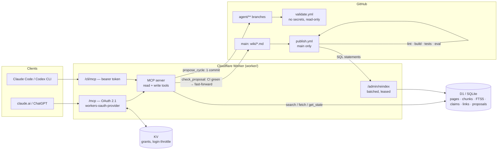
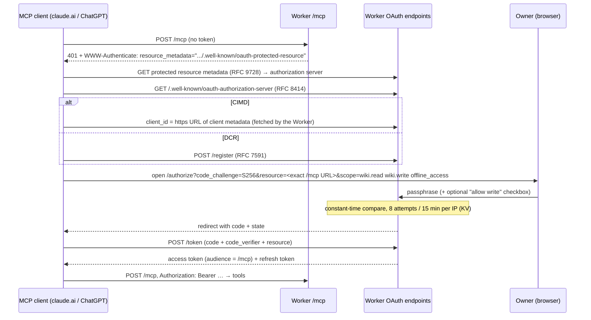

# wiki-mcp

An agent-maintained wiki served as a **remote MCP server**. Markdown in Git is
the source of truth; a Cloudflare Worker indexes it into D1 and exposes it to
any MCP client — claude.ai and ChatGPT over OAuth 2.1, Claude Code and Codex CLI
over a bearer token. Agents can **read** (full-text search, structured
current-state lookups, link graph) and, when authorized, **write** — but never
straight to `main`: every write is a whole research cycle on an `agent/**`
branch that merges only after CI passes.

This repository is a template extracted from a private deployment that has run
with ~536 pages and 187 machine-readable claims. It ships with a small, neutral
demo corpus (12 pages about MCP, OAuth 2.1, FTS search and retrieval
evaluation) so every check runs green out of the box. Replace `wiki/`,
`purpose.md` and `tests/golden.yaml` with your own subject.

- [Architecture](#architecture)
- [MCP tools](#mcp-tools)
- [OAuth flow](#oauth-flow)
- [How agents write: proposal branches + CI gate](#how-agents-write-proposal-branches--ci-gate)
- [Retrieval and eval methodology](#retrieval-and-eval-methodology)
- [Deploy](#deploy)
- [Repository layout](#repository-layout)

## Architecture



**The one invariant:** markdown under `wiki/` is the source of truth. D1,
`wiki/index.md`, `wiki/log.md` and `wiki/state.md` are derived and rebuilt; if
they disagree with the markdown, they are wrong.

Key pieces:

| Piece | What it does |
|---|---|
| `schema.md`, `tools/lint.py` | Frontmatter contract (types, summary, status, supersession, claims). CI fails on errors. |
| `tools/build.py` | Regenerates index/log/state and propagates `supersedes` → `superseded_by` + `status: superseded`. |
| `tools/export_index.py` | Renders the vault into SQL for D1 (heading chunks, FTS5, claims, links, threads) and self-checks a local SQLite copy. |
| `tools/query.py` | The same SQL and ranking as `worker/src/search.ts`, locally. |
| `tools/eval.py`, `tests/golden.yaml` | recall@5 / MRR / staleness gate. |
| `tools/export_schema.py`, `tools/export_context.py` | Generate the Worker's schema constants and bundle `AGENTS.md`, `schema.md`, `purpose.md` and the method page, so a client without a clone gets the contract via `get_working_context`. CI fails if stale. |
| `worker/` | The MCP server: TypeScript, `@modelcontextprotocol/server`, `agents` (`createMcpHandler`), `@cloudflare/workers-oauth-provider`, D1, KV. |

The Worker is stateless: it builds a fresh MCP server per request (MCP
2026-07-28 removed protocol sessions), and every multi-query read checks the
index generation before and after so a reader never sees half of a rebuild.

## MCP tools

| Tool | Lane | Purpose |
|---|---|---|
| `get_working_context` | read | Purpose, AGENTS, schema and method documents with hashes. Start here. |
| `search` | read | Field-weighted BM25 over heading chunks; returns date and status with every hit. |
| `fetch` | read | One page with frontmatter; bounded continuation via `next_offset`. Wrapped as data, not instructions. |
| `get_state` | read | Current value of a claim `(subject, metric, qualifier)` with citation and earlier values; version-aware. |
| `get_refresh_queue` | read | Missing current-version measurements and observations past `review_after`. |
| `get_backlinks` | read | Inbound links grouped by kind (related, source, supersedes, entities, body). |
| `list_by_type` | read | Paged listing by type/status/date. |
| `get_open_threads` | read | Unfinished cycles from each log entry's `next`. |
| `get_index_status` | read | Indexed commit, counts, contract hashes. |
| `propose_cycle` | write | Validate a whole cycle and commit it to an `agent/**` branch. |
| `check_proposal` | write | Poll CI; fast-forward `main` on green, return lint errors on red. |
| `abandon_proposal` | write | Drop a proposal and its branch. |

Read tools carry `readOnlyHint`. Write tools are registered only for the bearer
lane or an OAuth grant that includes `wiki.write`.

## OAuth flow

`/mcp` is an OAuth 2.1 protected resource. `@cloudflare/workers-oauth-provider`
implements discovery, Client ID Metadata Documents (CIMD), Dynamic Client
Registration (RFC 7591), PKCE, token issue and refresh. `worker/src/auth.ts`
only renders the consent page and decides scopes.



Scope rules:

- A correct passphrase grants `wiki.read` (and `offline_access` if requested).
- `wiki.write` is granted only if the client **requested** it **and** the owner
  ticked the write checkbox. Identity does not imply write consent.
- The protected-resource `resource` must equal the URL typed into the client,
  character for character. Set `PUBLIC_MCP_URL` in `worker/wrangler.jsonc` to
  pin it; empty means `<request origin>/mcp`.

`/cli/mcp` is a separate route with a static bearer token (`MCP_TOKEN`,
constant-time compared) for clients that can send a header. It must not start
with `/mcp`: the OAuth provider matches API routes by prefix.

`WIKI_PASSPHRASE=... python tools/test_oauth.py https://<worker>/mcp` walks the
whole flow against a deployment — discovery, registration, PKCE, wrong
passphrase, wrong verifier, token, an authenticated tool call and refresh.

## How agents write: proposal branches + CI gate

The write primitive is a **cycle**, not a page: one research trail, zero or more
outputs (source, concept, finding, comparison, thesis, synthesis, query) and
exactly one log entry whose `next` says where the agent stopped. A per-page
tool would let a finding land with no evidence trail.

```mermaid
sequenceDiagram
  participant A as Agent
  participant W as Worker
  participant D as D1
  participant G as GitHub
  participant CI as validate.yml

  A->>W: propose_cycle(question, research, outputs, log)
  W->>D: pre-validate against index (slugs, supersedes, claim contradictions)
  alt problems
    W-->>A: rejected + exact problems (nothing written)
  else ok
    W->>D: take merge lock; require index head == main
    W->>G: blobs → tree → ONE commit → ref agent/<date>-<slug>
    W-->>A: queued, proposal_id
    G->>CI: push agent/** → lint, invariants, tests, eval, only-wiki/ guard
    A->>W: check_proposal(id)
    W->>G: validate.yml run for this exact SHA + branch?
    alt green
      W->>G: fast-forward main (non-forced; fails if main moved)
      G->>G: publish.yml on main → rebuild derived files → reindex D1
      W-->>A: merged
    else red
      W-->>A: failed + linter annotations (branch kept for reading)
    end
  end
```

Why it is shaped this way:

- **`validate.yml` is untrusted.** It runs branch content an agent wrote, from
  that branch's own workflow definition, so it has `contents: read` and no
  secrets. An `agent/**` branch that touches anything outside `wiki/`, or
  carries generated files, fails.
- **`publish.yml` runs only on `main`**, from `main`'s definition. It is the
  only writer of derived files and the only job holding a secret
  (`WIKI_ADMIN_TOKEN`, to push the index to the Worker).
- **The Worker merges, not CI.** A push made with Actions' `GITHUB_TOKEN` does
  not trigger other workflows, so a CI-side merge would never publish. The
  Worker's GitHub token is a different identity; its fast-forward triggers
  `publish.yml`, whose own commit does not re-trigger it.
- **Merge lock + exact-SHA check** make "branch green" imply "main green": the
  branch is cut from `main` inside the lock, and a non-forced ref update fails if
  `main` moved after validation.
- **Server-set metadata.** `created`, `updated`, log `date` and `author` are set
  by the server; models are routinely wrong about the date.
- A daily cron deletes abandoned `agent/**` branches after seven days.

`WIKI_MCP_TOKEN=... python tools/test_write.py https://<worker>/cli/mcp`
exercises the refusals (path traversal, generated marker, existing slug,
dangling `supersedes`, contradicting claim, future-dated claim). `--live` writes
and merges a real probe cycle.

## Retrieval and eval methodology

**Retrieval** (`worker/src/search.ts`, mirrored by `tools/query.py`):

1. **Structured first.** "What is the current X" goes to `get_state`: claims
   keyed by `(subject, metric, qualifier)`, newest `as_of` wins, superseded pages
   excluded, citation attached. Versioned metrics (`bench-index-v2.1`) are never
   mixed across versions; an `active-version` claim selects which is current.
2. **FTS5 BM25 over heading chunks**, columns `title, summary, heading, symbols,
   text` weighted `2, 2, 1, 4, 1`. A page scores as its single best chunk.
3. **Symbols column.** Identifiers with digits (`oauth-2.1`) are stored also in
   collapsed form (`oauth21`) so they rank as one rare token instead of
   `oauth`/`2`/`1`.
4. **Type prior** (finding/comparison/thesis/synthesis ×1.2; research/source/log
   ×0.7) and **one hop over curated links** (+0.1 × seed score).
5. **Status filter.** Only `status: current` unless `include_superseded`.

All user terms are emitted as quoted FTS5 phrases, so input cannot change the
query's meaning.

**Evaluation** (`tools/eval.py` over `tests/golden.yaml`):

- **recall@5** — an expected page in the top five. CI gate: ≥ 0.80.
- **MRR** — mean of 1/rank of the first expected hit.
- **staleness rate** — among questions that name known-outdated pages, how often
  the top hit is one of them. CI gate: ≤ 0.30. A stale top hit is a confident
  wrong answer, which is worse than a miss.
- The harness fails if the golden set names a page that does not exist.
- `--endpoint https://<worker>/cli/mcp` scores the deployed server with the
  same questions; local and served must agree, because they run the same SQL
  over the same index.
- `tools/tune.py` sweeps weights, type priors and graph boost against the set.

Numbers:

| Corpus | Questions | recall@5 | MRR | staleness |
|---|---:|---:|---:|---:|
| Original private wiki (~536 pages) | 30 | 0.83 | — | — |
| This demo corpus (12 pages) | 18 | 0.94 | 0.88 | 0.00 |

The 0.83 was measured on the private corpus the ranking weights were tuned for;
the demo number is on 12 pages and says little about ranking quality. It does
show the design point: "what is the latest MCP revision" ranks the right page
only #5 in plain search, because three dated pages look alike to BM25, while
`get_state` answers it in one row. The one miss ("which open question did the
last cycle leave") is a question for `get_open_threads`, not for search.

## Deploy

Prerequisites: Node 24+, Python 3.12+ with `pyyaml`, a Cloudflare account,
a GitHub repository created from this template.

**1. Local checks**

```bash
pip install pyyaml
python tools/lint.py && python tools/build.py --check
python tools/export_schema.py --check && python tools/export_context.py --check
python tests/test_invariants.py
python -m unittest discover -s tests -p "test_*.py"
python tools/export_index.py --full --out dist/d1 --sqlite dist/wiki.db
python tools/eval.py --verbose
cd worker && npm ci && npm run typecheck && npm test
```

**2. Cloudflare resources**

```bash
cd worker
npx wrangler login
npx wrangler d1 create wiki-mcp            # → database_id
npx wrangler kv namespace create OAUTH_KV   # → id
```

Put both IDs into `worker/wrangler.jsonc` (replacing `<YOUR_D1_DATABASE_ID>`
and `<YOUR_KV_NAMESPACE_ID>`), set `GITHUB_REPO` to your `owner/name`, and
optionally `PUBLIC_MCP_URL`.

**3. Secrets on the Worker** (generate long random values, e.g.
`python -c "import secrets; print(secrets.token_urlsafe(32))"`):

```bash
npx wrangler secret put MCP_TOKEN        # bearer for /cli/mcp
npx wrangler secret put WIKI_PASSPHRASE  # owner passphrase on the OAuth consent page
npx wrangler secret put ADMIN_TOKEN      # protects /admin/reindex
npx wrangler secret put GITHUB_TOKEN     # only needed for the write path
npx wrangler deploy
```

`GITHUB_TOKEN` should be a **fine-grained** token limited to this one
repository: Contents read/write, Actions read, Checks read, Metadata read. Without
the Workflows permission it cannot modify `.github/workflows/`, and it cannot touch
settings, secrets or other repositories.

**4. GitHub** — repository secret `WIKI_ADMIN_TOKEN` (same value as
`ADMIN_TOKEN`) and repository variable `WIKI_BASE_URL`
(`https://wiki-mcp.<subdomain>.workers.dev`). Until `WIKI_BASE_URL` is set,
`publish.yml` validates and rebuilds but skips the reindex step. Protect `main`
if you like, but allow the Worker's token to update it.

**5. First index** — push to `main` (or run `publish` manually), or from your
machine:

```bash
WIKI_ADMIN_TOKEN=... python tools/push_index.py https://wiki-mcp.<subdomain>.workers.dev --full
curl -s https://wiki-mcp.<subdomain>.workers.dev/health
```

**6. Connect clients**

- claude.ai → Settings → Connectors → Add custom connector →
  `https://wiki-mcp.<subdomain>.workers.dev/mcp` (exactly; no trailing slash).
- ChatGPT → the same URL as a custom MCP connector.
- Claude Code → copy `.mcp.example.json` to `.mcp.json` (git-ignored), set
  `WIKI_MCP_TOKEN` in your environment.
- Codex CLI → `~/.codex/config.toml`:

  ```toml
  [mcp_servers.wiki]
  url = "https://wiki-mcp.<subdomain>.workers.dev/cli/mcp"
  bearer_token_env_var = "WIKI_MCP_TOKEN"
  ```

**Rotating.** `wrangler secret put` again. Rotating `WIKI_PASSPHRASE` stops new
grants but does not revoke live ones; clear `OAUTH_KV` or remove the connector
to cut existing access.

## Repository layout

```text
AGENTS.md            operating contract for every agent (mechanics)
schema.md            frontmatter contract, enforced by tools/lint.py
purpose.md           what this wiki is for (replace)
templates/           page skeletons per type
wiki/                the corpus — source of truth
  methodology/research-cycle-idea-to-thesis.md   the method (bundled into the Worker)
  index.md log.md state.md                       generated, never edit
tools/               lint, build, export, query, eval, tune, extract, push, smoke tests
tests/               golden.yaml, invariants, index and measurement regressions
worker/              Cloudflare Worker: MCP server, OAuth, D1 index, write path
.github/workflows/   validate.yml (untrusted branches), publish.yml (main only)
```

## License

[MIT](LICENSE) © 2026 Iaroslav
